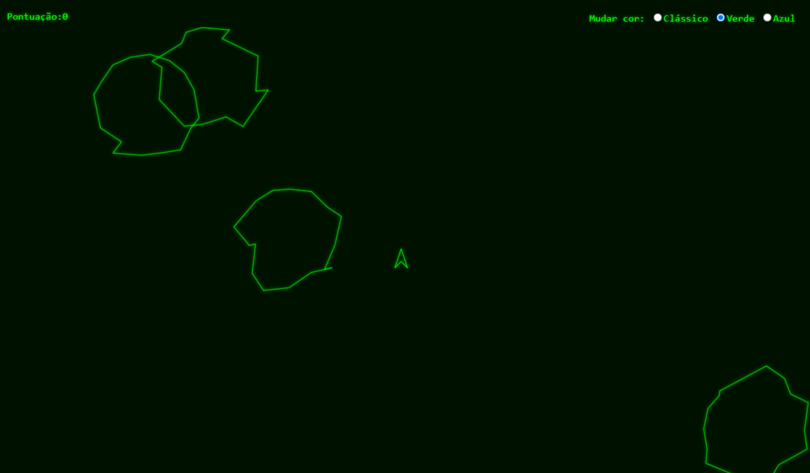

# Asteroids

## Sobre

Este projeto é um clone simples do clássico jogo Asteroids de 1979, desenvolvido em JavaScript para fins educacionais e de entretenimento.

## Funcionalidades

- Controle da nave com teclado
- Disparo de projéteis
- Asteroides com movimentação e colisão
- Pontuação baseada em destruição de asteroides
- Reinício automático após fim de jogo

## Como executar

1. Clone o repositório:
   ```bash
   git clone https://github.com/seu-usuario/asteroids-79.git
   ```
2. Abra o arquivo `index.html` em seu navegador.

## Requisitos

- Navegador moderno (Chrome, Firefox, Edge, etc.)

## Créditos

Inspirado no clássico Asteroids (Atari, 1979).

## Licença

Este projeto está sob a licença MIT.


